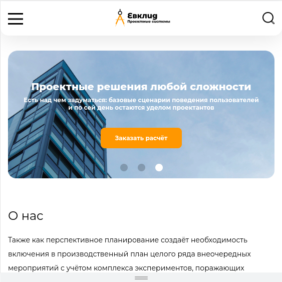

# euclid-layout

> Landing page for Euclid company in HTML/CSS/JS (Educational example).
> Live demo [_here_](https://sashauly.github.io/euclid-layout/).

## Table of Contents
- [euclid-layout](#euclid-layout)
  - [Table of Contents](#table-of-contents)
  - [General Information](#general-information)
  - [Technologies Used](#technologies-used)
  - [Features](#features)
  - [Usage](#usage)
  - [Acknowledgements](#acknowledgements)
  - [Project status](#project-status)
  - [Contacts](#contacts)

## General Information
- Hodgepodge in the form of a simple landing page to consolidate knowledge of html, css, javascript

## Technologies Used
- HTML
- CSS
- JavaScript ES6
- [BEM naming](https://ru.bem.info/)
- [ARIA](https://developer.mozilla.org/ru/docs/Web/Accessibility/ARIA/ARIA_Techniques)
- [Google Fonts](https://fonts.google.com/)
- [normalize.css](github.com/necolas/normalize.css)
- [typograf](https://www.artlebedev.ru/typograf/)
- [SwiperAPI](https://swiperjs.com/)
- [michu2k Accordion](https://github.com/michu2k/Accordion)
- [{JSON} Placeholder](https://jsonplaceholder.typicode.com/)

## Features
- Basic landing page with semantic layout(main, footer, hero section and all that)
- Responsive design
- Slider, accordion
- Form with placeholder
- Also work with text-to-speech recognition

## Usage
Just open the [live version](https://sashauly.github.io/euclid-layout/). For now this project served for presentation purposes

## Acknowledgements
- Many thanks to my mentor [Vlad Chistyakov](https://github.com/Vladislav-Chistyakov)

## Project status
Project is: _complete_
## Contacts
Created by [@sashauly](https://t.me/sashauly) - feel free to contact me!